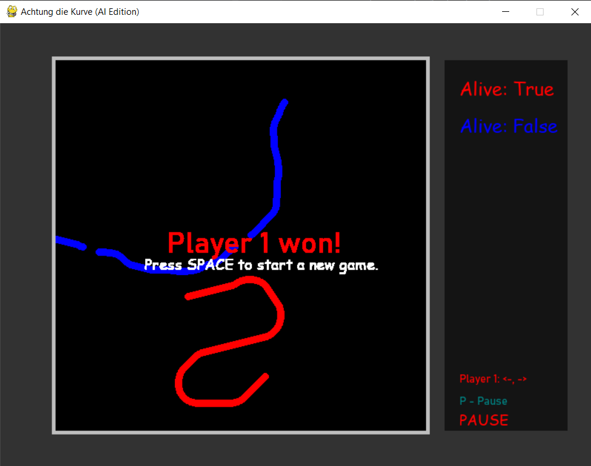

# Achtung die Kurve

## Intoduction

This project came to live to let me pass *AI in games* classes during my Master's course. Nevertheless, I think that in a very short time I make a lot.

I've reimplemented a well known, classic game *Achtung die Kurve*. It isn't full reimplementation, only a simplified version (there are no bonuses). The main purpose of this project wasn't to create a very detailed game. It was to try few AI approaches to create agents that will play good in this game or even beat a human.

I've tested three approaches:
 - heuristics,
 - Reinforcement Learning,
 - Evolution Algorithm

## Project structure

### ai

Here I've put three files, each one has one of AI approach.

**HeuristicPlayer.py** - consists two, simple heuristics, that are able to survive a little longer than random player. They only have information about obstacles around them, and they try to survive as long as possible.

**RLPlayer.py** - there is my implementation of DQN algorithm in **pytorch** library. Unfortunately, I couldn't tune this algorithm during my available time, so this agent didn't achieve any success. 

**EAPlayer.py** - implementation of player to be used with evolutionary optimization using **deap** library. Similiar to heuristic one, but he has also frozen neural network to find the best action. The purpose is to find optimal weights for this neural network during optimization phase.

### game

Files consist a whole game's logic. I've based on OOP paradigm. Here each file consist one, public-used class.

**Game.py** - this class is the top one in game hierarchy. It manages creating new Round instances and tick() procedure, which update game every iteration.

**Round.py** - this class implements round in game. Mostly initializing player position, handling no_clip of players and updates of game_state.

**Board.py** - this class implements board, which is NxM matrix containing all obstacles created during game. It also has to check for collisions during game

**Player.py** - player interface. Also contains classes for random and human player

**Bonus.py** - not implemented

### gui

**Gui.py** - here is whole GUI logic with serve of **pygame** library. It also allow humans to play in the game. GUI is totally independent from a game logic. It communicates with backend game_process via queue.

####...

There are also some files in a root directory of the project:

**ea_...** prefix - relates to Evolution Algorithm

**rl_...** prefix - relates to Reinforcement Learning

**..._training_single_player** suffix - relates to one-player training with goal to surive as long as possible

**..._training_multi_player** suffix - relates to multi-player training (by default 4 players). Here, one player train to win most games against other players. By some games, weights of training player are copied to his enemies, so he train to beat himself

**..._players_game** suffix - Here I visually evaluated (with GUI), how trained players learned to play the game. 

**evaluate_...** prefix - All players (random. heurisitic and trained) compete together to produce some statistics for further analysis.

**main.py** - Run a game with custom settings. Note that this game isn't fully completed (it doesn't have player selection menu).

## TODO:

This game needs an interface to set up players. With that it would be fully operational game. But it wasn't the main purpose of this project :/